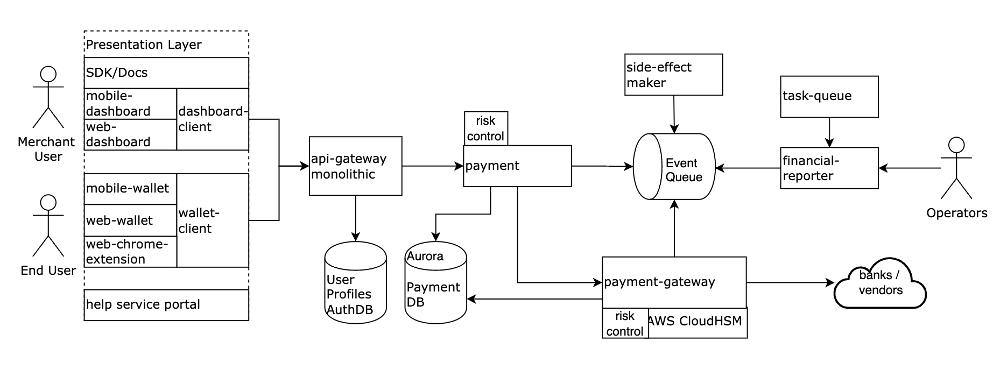

# Clarifying Requirements 

Designing a service money transfer backend system like Square Cash (we will call this system Cash App below) or PayPal to

1. Deposit from and payout to bank
1. Transfer between accounts
1. High scalability and availability
1. i18n: language, timezone, currency exchange
1. Deduplication for non-idempotent APIs and for at-least-once delivery.
1. Consistency across multiple data sources.

## Architecture

## Features and Components 

### Payment Service 

The payment data model is essentially “double-entry bookkeeping”. Every entry to an account requires a corresponding and opposite entry to a different account. Sum of all debit and credit equals to zero.

### Deposit and Payout 

Transaction: new user Jane Doe deposits $100 from bank to Cash App. This one transaction involves those DB entries:

bookkeeping table (for history)

> + debit, USD, 100, 
> CashAppAccountNumber, txId
> - credit, USD, 100, RoutingNumber: AccountNumber, txId
  
transaction table

> txId, timestamp, status(pending/confirmed), [bookkeeping entries], narration

Once the bank confirmed the transaction, update the pending status above and the following balance sheet in one transaction.

balance sheet

> CashAppAccountNumber, USD, 100

### Transfer between accounts within Cash App 

Similar to the case above, but there is no pending state because we do not need the slow external system to change their state. All changes in bookkeeping table, transaction table, and balance sheet table happen in one transaction.

### i18n 

We solve the i18n problems in 3 dimensions.

1. Language: All texts like copywriting, push notifications, emails are picked up according to the accept-language header.
1. Timezones: All server timezones are in UTC. We transform timestamps to the local timezone in the client-side.
1. Currency: All user transferring transactions must be in the same currency. If they want to move across currencies, they have to exchange the currency first, in a rate that is favorable to the Cash App.

For example, Jane Doe wants to exchange 1 USD with 6.8 CNY with 0.2

bookkeeping table

> - credit, USD, 1, CashAppAccountNumber, txId
> + debit, CNY, 6.8, CashAppAccountNumber, txId, @7.55 CNY/USD
> + debit, USD, 0.1, ExpensesOfExchangeAccountNumber, txId

Transaction table, balance sheet, etc. are similar to the transaction discussed in Deposit and Payout. The major difference is that the bank or the vendor provides the exchange service.

### How to sync across the transaction table and external banks and vendors? 

- retry with idempotency to improve the success rate of the external calls and ensure no duplicate orders.
- two ways to check if the PENDING orders are filled or failed.
    - poll: cronjobs (SWF, Airflow, Cadence, etc.) to poll the status for PENDING orders.
    - callback: provide a callback API for the external vendors.
- Graceful shutdown. The bank gateway calls may take tens of seconds to finish, and restarting the servers may resume unfinished transactions from the database. The process may create too many connections. To reduce connections, before the shutdown, stop accepting new requests and wait for the existing outgoing ones to wrap up.

### Deduplication 

Why is Deduplication a concern?

1. not all endpoints are idempotent
1. Event queue may be at-least-once.

not all endpoints are idempotent: what if the external system is not idempotent? 

For the `poll` case above, if the external gateway does not support idempotent APIs, in order not to flood with duplicate entries, we must keep record of the order ID or the reference ID the external system gives us with 200, and query `GET` by the order ID instead of `POST` all the time.

For the `callback` case, we can ensure we implement with idempotent APIs, and we mutate `pending` to `confirmed` anyway.

Event queue may be at-least-once 

- For the even queue, we can use an exactly-once Kafka with the producer throughput declines only by 3%.
- In the database layer, we can use idempotency key or deduplication key.
- In the service layer, we can use Redis key-value store.

Availability and Scalability 

- Overall failover strategies: Improving availability with failover: Cold Standby, Hot Standby, Warm Standby, Active-active.
- Service layer scaling: AKF Scale Cube
- Data layer scaling: CQRS Pattern
- Needing a speed layer? Lambda Architecture

## References

- [Tiapan - Designing Square Cash or PayPal Money Transfer System](https://tianpan.co/notes/167-designing-paypal-money-transfer)
- [Tiapan - Designing payment webhook](https://tianpan.co/notes/166-designing-payment-webhook)
- [Tiapan - Credit Card Processing System](https://tianpan.co/notes/236-credit-card-processing-system)