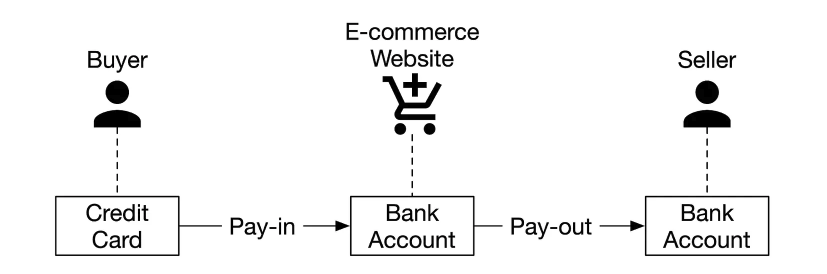
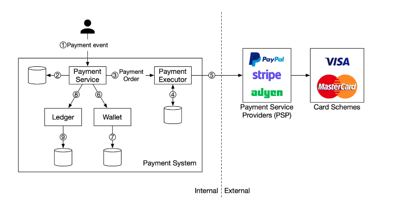

## Step 1: understand the problem

- Functional requirements
  - Pay-in flow: payment system receives money from customers on behalf of sellers.

  - Pay-out flow: payment system sends money to sellers around the world.

- Non-functional requirements
  - Reliability and fault tolerance. Failed payments need to be carefully handled.

  - A reconciliation process between internal services (payment systems, accounting systems) and external services (payment service providers) is required. The process asynchronously verifies that the payment information across these systems is consistent.

- Back-of-the-envelope estimations
  - The system needs to process 1 million transactions per day, which is 1,000,000 transactions / 10^5 seconds = 10 transactions per second (TPS). 10 TPS is not a big number for a typical database, which means the focus of this system design interview is on how to correctly handle payment transactions, rather than aiming for high throughput.

## Step 2: high-level design

At a high level, the payment flow is broken down into two steps to reflect how money flows:

- Pay-in flow

- Pay-out flow

Take the e-commerce site, Amazon, as an example. After a buyer places an order, the money flows into Amazon’s bank account, which is the pay-in flow. Although the money is in Amazon's bank account, Amazon does not own all of the money. The seller owns a substantial part of it and Amazon only works as the money custodian for a fee. Later, when the products are delivered and money is released, the balance after fees then flows from Amazon’s bank account to the seller's bank account. This is the pay-out flow. The simplified pay-in and pay-out flows are shown in Figure 1.

### Pay-in flow

The high-level design diagram for the pay-in flow is shown in Figure 2. Let’s take a look at each component of the system.

- Payment service

    The payment service accepts payment events from users and coordinates the payment process. The first thing it usually does is a risk check, assessing for compliance with regulations such as AML/CFT [2], and for evidence of criminal activity such as money laundering or financing of terrorism. The payment service only processes payments that pass this risk check. Usually, the risk check service uses a third-party provider because it is very complicated and highly specialized.

- Payment executor

    The payment executor executes a single payment order via a Payment Service Provider (PSP). A payment event may contain several payment orders.

- Payment service provider

    A PSP moves money from account A to account B. In this simplified example, the PSP moves the money out of the buyer’s credit card account. 

- Card schemes

    Card schemes are the organizations that process credit card operations. Well known card schemes are Visa, MasterCard, Discovery, etc. The card scheme ecosystem is very complex [3].

- Ledger

    The ledger keeps a financial record of the payment transaction. For example, when a user pays the seller $1, we record it as debit $1 from a user and credit $1 to the seller. The ledger system is very important in post-payment analysis, such as calculating the total revenue of the e-commerce website or forecasting future revenue. 

- Wallet

    The wallet keeps the account balance of the merchant. It may also record how much a given user has paid in total. 

    As shown in Figure 2, a typical pay-in flow works like this:

    1. When a user clicks the “place order” button, a payment event is generated and sent to the payment service.

    1. The payment service stores the payment event in the database.

    1. Sometimes, a single payment event may contain several payment orders. For example, you may select products from multiple sellers in a single checkout process. If the e-commerce website splits the checkout into multiple payment orders, the payment service calls the payment executor for each payment order.

    1. The payment executor stores the payment order in the database.

    1. The payment executor calls an external PSP to process the credit card payment.

    1. After the payment executor has successfully processed the payment, the payment service updates the wallet to record how much money a given seller has.

    1. The wallet server stores the updated balance information in the database.

    1. After the wallet service has successfully updated the seller’s balance information, the payment service calls the ledger to update it.

    1. The ledger service appends the new ledger information to the database.

- Double-entry ledger system

## Step 3: design deep dive

- PSP integration

- Reconciliation

- Handling processing delays

- Handling failed payments

- Exactly-once delivery

- Consistency

- Payment security

## Tech Stack

## Security

## Features

- Opening Accounts
- Linking Bank Accounts
- Adding Debit/Credit Cards
- Completing Online Payment
- Transaction Reporting
- Deposit and Payout
- Payment Gateways Access
- Refunds initiation
- Subscription and recurring billing

## Reference

- [Pragmaticengineer](https://newsletter.pragmaticengineer.com/p/designing-a-payment-system)

- [Freecodecamp](https://www.freecodecamp.org/news/how-to-design-payment-logic-on-stripe-and-apply-it/)

- [Devteam](https://www.devteam.space/blog/how-to-build-an-online-payment-app-like-paypal/)

- [Engineeringenablement](https://engineeringenablement.substack.com/p/designing-stripe-for-black-friday)